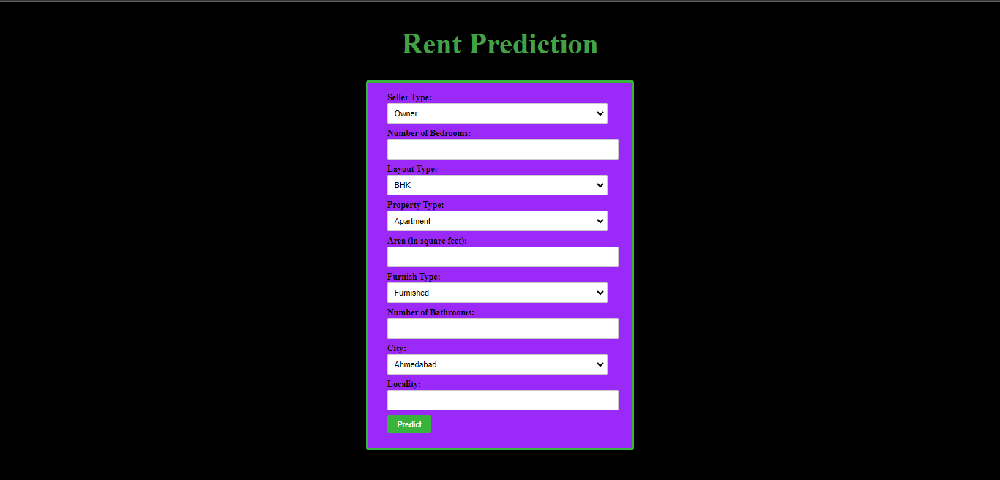

# Rent-Prediction

This is a Machine Learning Model which is trained on a dataset from Kaggle. The data contains information about number of bedrooms, bathrooms, city, locality, furnish type etc.
The model uses XGBOOST Algorithm and has an accuracy of 90%.
The project is deployed using Flask.

## How to Run:-
Go to website https://rent-predictor.onrender.com/ and check it out!

